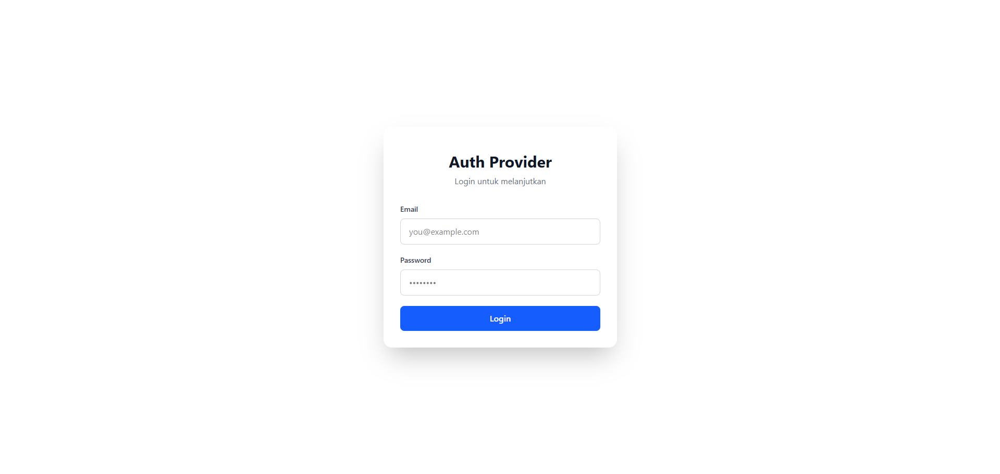
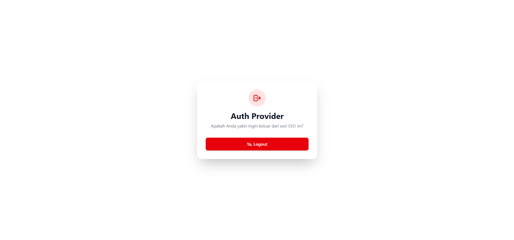
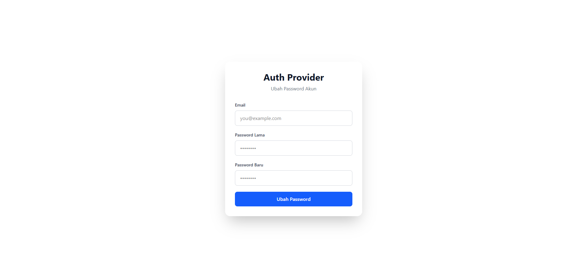
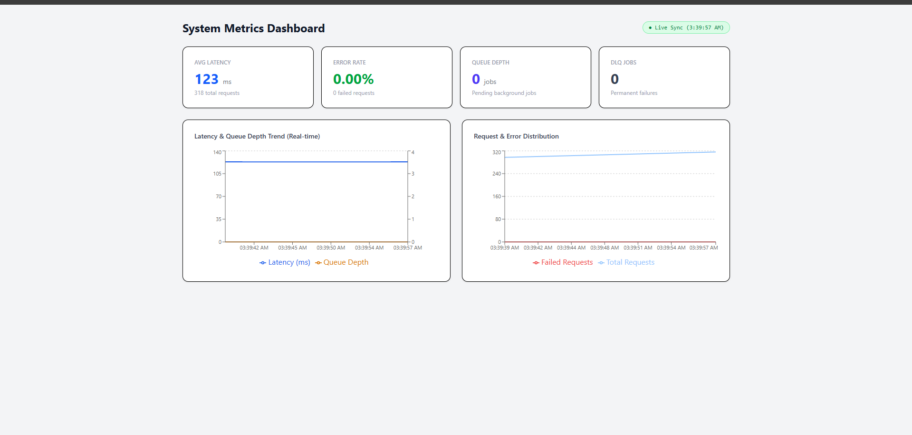
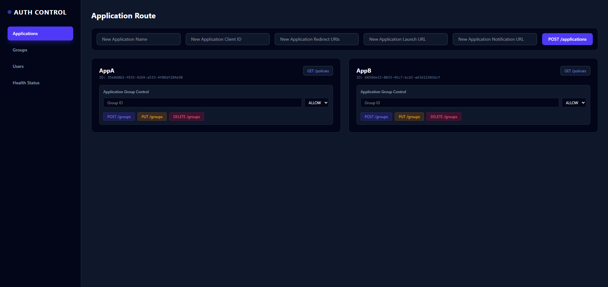
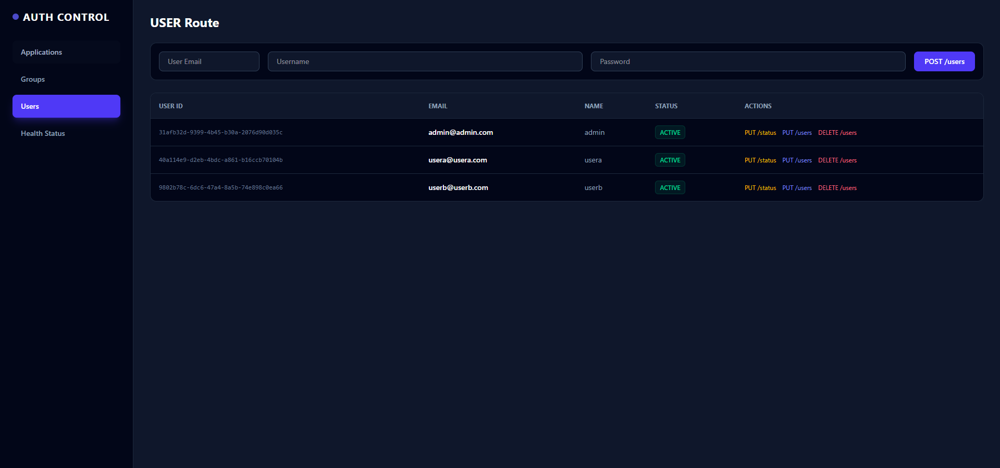
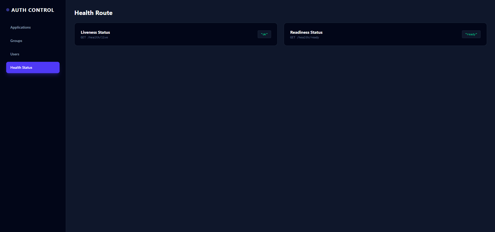
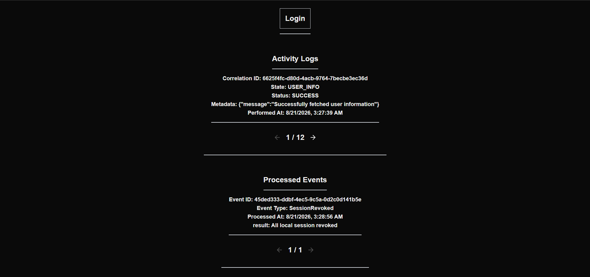
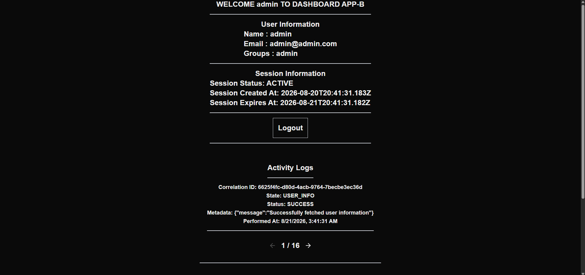
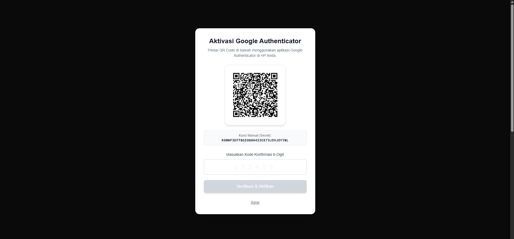

---

# Identity Provider & Single Sign-On (SSO) Platform

Sistem manajemen identitas terpusat, penyedia layanan otentikasi (Auth Provider), dan Single Sign-On (SSO) berbasis OAuth2/OIDC.

---

## 1. Identitas

* **Nama:** Junior Natra Situmorang
* **NIM:** 13524055

---

## 2. Technology Stack

| Komponen | Teknologi | Versi |
| --- | --- | --- |
| **Backend Framework** | Express.js / TypeScript | `v5.2.1` / `4.23.12` |
| **Database & ORM** | Prisma ORM | `v7.9.1` |
| **Frontend Framework** | React + Vite / Next.js | `v19.2.8` / `v16.3.0` |
| **Containerization** | Docker & Docker Compose | latest |
| **Security & Cryptography** | `bcrypt`, `crypto`, `jsonwebtoken` | Latest |
| **Observability & Metrics** | `prom-client` & Recharts | Prometheus metrics collector & Chart visualization |

---

## 3. Arsitektur & Alur Sistem

### Ringkasan Arsitektur Monorepo

```text
                                  +-----------------------+
                                  |   Browser Client      |
                                  +-----------+-----------+
                                              |
                   +--------------------------+--------------------------+
                   | (Port 3000)                                         | (Port 3001)
                   v                                                     v
      +-------------------------+                           +-------------------------+
      |    Auth Provider UI     |                           |    Application Client   |
      |     (Vite + React)      |                           |    (Next.js App Router) |
      +------------+------------+                           +------------+------------+
                   |                                                     |
                   | (REST API / Port 8080)                              | (Back-Channel Webhook)
                   v                                                     ^
      +-------------------------+                                        |
      |   Auth Provider Core    |                                        |
      |  (Express + Prisma ORM) |                                        |
      +------------+------------+                                        |
                   |                                                     |
      +------------+------------+                           +------------+------------+
      |   PostgreSQL Database   | <--- (Read/Write Queue) - |       Sync Worker       |
      |        (Port 5432)      |                           |   (Background Service)  |
      +-------------------------+                           +-------------------------+

```

### Alur Kerja Otentikasi Utama

1. **Authorization Code Flow:** Aplikasi client mengarahkan user ke `/login` $\rightarrow$ `/authorize`. Setelah otentikasi berhasil, Auth Provider menerbitkan *authorization code* yang ditukarkan aplikasi client menjadi `access_token` apabila user mengaktifkan MFA maka `access_token` tidak akan diterbitkan dan memerlukan TOTP dari google authenticator yang nantinya apabila success maka `access_token` baru akan diterbitkan.
2. **Back-Channel Logout:** Saat sesi pusat (*sso_session*) berakhir, policy pengguna berubah, atau user mengubah password, Sync Worker mengambil event dari database dan mengirimkan webhook POST ke `/interna/logout` yang dikirim ke app client yang bersangkutan, misal apabila `sessionRevoked` dan `PasswordChanged` maka akan dikirimkan keseluruh app, sedangkan untuk `AccessPolicyChanged` hanya akan dikirimkan ke session user yang terpengaruh oleh perubahan policy dan dikirimkan ke application yang policy nya diubah.

---

## 4. Keputusan Teknis

### A. Pilihan Token (Opaque vs JWT) & Konsekuensinya

* **Central SSO Session (`session_token`):** Menggunakan **Opaque Token** (string acak 32-byte dari `crypto.randomBytes`) yang di-hash dengan **SHA-256** sebelum disimpan di database (`sso_sessions`).
* *Konsekuensi:* Mengorbankan sedikit performa karena memerlukan I/O database pada setiap verifikasi sesi, tetapi memberikan **kontrol pencabutan akses seketika (*instant revocation*)** di seluruh jaringan aplikasi SSO.

* **Access Token:** Menggunakan **Opaque JTI / Token Hash** yang terikat pada `application_id`, `user_id`, dan `sso_session_id`.
* *Konsekuensi:* Memudahkan validasi status aktif (`ACTIVE` vs `REVOKED`) di tingkat aplikasi.

### B. Pilihan Message Broker (DB-backed Queue Worker)

* **Keputusan:** Menggunakan **Custom DB-Backed Event Queue** berbasis tabel `events` dan `event_deliveries` yang dieksekusi oleh service `sync-worker`.
* **Alasan:** Menghindari overhead infrastruktur tambahan (seperti RabbitMQ atau Redis/BullMQ) pada skala sistem saat ini. Worker mendukung fitur *exponential backoff retry*, batas maksimal percobaan (*max attempts*), serta pencatatan otomatis ke **Dead-Letter Queue (DLQ)** jika pengiriman gagal permanen.

### C. Autentikasi Service-to-Service (`/internal/logout`)

* **Keputusan:** Menggunakan **Internal Service Secret (HMAC SHA-256 Signature / Shared Secret Header)** pada panggilan webhook yang disimpan di database antara `sync-worker` dan endpoint client.
* **Alasan:** Memastikan bahwa endpoint pencabutan sesi lokal hanya menerima perintah resmi dari `sync-worker` dan menolak request dari pihak luar.

### D. Pilihan Soft-Delete vs Hard-Delete

* **Keputusan:** Menggunakan **Soft-Delete / Status State Pattern** (`ACTIVE`, `INACTIVE`, `EXPIRED`, `REVOKED`). 
* **Alasan:** Menjaga *referential integrity* relational database untuk riwayat jejak audit (`audit_logs`), serta mencegah kehilangan data historis otentikasi dan transaksi keamanan.

* **Keputusan:** Menggunakan **Hard-Delete** 
* **Alasan:** Keputusan menggunakan Hard-Delete (Cascade) dipilih agar saat Admin menghapus suatu data, semua data yang terhubung di tabel lain otomatis ikut terhapus. Dengan begitu, database selalu bersih dari data sampah dan tidak ada sisa data yang menggantung.

### E. Pemilihan Stack
* **PostgreSQL:** Database relasional yang sangat stabil dan patuh terhadap standar ACID. Sangat cocok untuk sistem autentikasi/SSO yang membutuhkan integritas data ketat, foreign key constraints, serta cascade delete yang aman antar-tabel (user, session, client, audit log).

* **Prisma ORM:** Memberikan type-safety penuh dari skema database hingga ke kode TypeScript. Meminimalkan kesalahan manipulasi data, mempermudah migrasi skema, dan mempercepat pembuatan query relasional tanpa perlu menulis SQL manual.

* **Express.js:** Framework backend yang lightweight, matang, dan tidak opasif (unopinionated). Sangat ideal untuk membangun core server SSO karena memberikan kontrol penuh atas pembuatan middleware, pengaturan cookie HttpOnly, header HTTP, serta penanganan protokol OAuth2/OIDC.

* **Vite (React):** Bundler dan perkakas frontend yang sangat cepat dengan Hot Module Replacement (HMR) instan. Tepat digunakan untuk membangun Control Panel internal berarsitektur Single Page Application (SPA) tanpa perlu beban overhead Server-Side Rendering (SSR).

* **Next.js:** Ideal untuk aplikasi klien (client app) atau portal publik yang membutuhkan keunggulan Server-Side Rendering (SSR), performa loading awal yang cepat, serta dukungan integrasi API internal yang rapi.

---

## 5. Cara Menjalankan Sistem

### Langkah 1: Persiapan Environment

Salin file `.env.example` menjadi `.env` di direktori utama:

```bash
cp .env.example .env
```

### Langkah 2: Jalankan Container Docker Compose

Jalankan seluruh service (Database, Auth Backend, Auth UI, Sync Worker, dan App Client):

```bash
docker compose up -d --build
```
Untuk process seeding akan berjalan bersama dengan docker compose up.

### URL Akses Tiap Komponen

| Komponen | Endpoint / URL | Keterangan |
| --- | --- | --- |
| **Auth Provider Backend API** | `http://localhost:8080` | Express REST Engine |
| **Auth Provider UI** | `http://localhost:5173` | Halaman Login, MFA, & SSO |
| **Application Client (App A)** | `http://localhost:3001` | Sample Client Application |
| **Application Client (App b)** | `http://localhost:3002` | Sample Client Application |
| **PostgreSQL Database** | `localhost:5432` | Database Server |
| **Control Panel Admin** | `localhost:3000` | Control Panel Admin |

---

## 6. Daftar Endpoint API dan Page
## 6.1. API
### OAuth2 / SSO Engine
`PORT: 8080`
* `GET /authorize` - Endpoint otorisasi OAuth2 (menerbitkan *authorization code*).
* `POST /logout` - Mencabut session saat ini di sso dan mencabut session local di setiap aplikasi
* `POST /login` - Melakukan login untuk membuat sso session
* `POST /change-password` - Mengubah password user dan me-revoked session user terkait
* `POST /token` - Menerbitkan access token dengan jwt code
* `GET /userinfo` - Endpoint yang digunakan untuk mengambil data user
* `GET /me` - Endpoint buat app server mengambil data user saat ini
* `GET /health/live` - Memeriksa Liveness Auth Server
* `GET /health/ready` - Memeriksa Readiness Auth Server

### Control Panel Admin
`PORT 3000`
#### Application Route
* `GET /applications` - Melihat semua data application
* `POST /applications` - Menambahkan data application
* `POST /applications/:id/groups` - Menambahkan Group ke application
* `DELETE /applications/:id/groups` - Menghapus Group ke application
* `PUT /applications/:id/groups` - Memperbarui Group Effect ke application
* `GET /applications/:id/policies` - Melihat Group Policies ke application

#### Group Route
* `GET /groups` - Melihat semua data groups
* `POST /groups` - Menambahkan data groups
* `GET /groups/:id` - Melihat Group berdasarkan id
* `PUT /groups/:id` - Mengubah data Group berdasarkan id
* `DELETE /groups/:id` - Menghapus data Group berdasarkan id
* `GET /groups/:id/users` - Melihat user di group berdasarkan id
* `POST /groups/:id/users` - menambahkan user ke group berdasarkan id 
* `GET /groups/:id/users` - menghapus user di group berdasarkan id 

#### USER Route
* `GET /users` - Melihat semua data user
* `POST /users` - Menambahkan data user
* `GET /users/:id` - Melihat data user berdasarkan ID
* `PUT /users/:id` - Mengubah data user berdasarkan ID
* `DELETE /users/:id` - Menghapus data user berdasarkan ID
* `GET /users/:id/status` - Melihat status user berdasarkan ID
* `PUT /users/:id/status` - mengubah status user berdasarkan ID

#### Health Route
* `GET /health/live` - Memeriksa Liveness Auth Server
* `GET /health/ready` - Memeriksa Readiness Auth Server

### Application Route
`PORT: 3001 (appA) & 3002(appB)`

* `POST /internal/logout` - Webhook receiver di sisi Client Application untuk mencabut sesi lokal.

---

### Sync Worker Health
`PORT: 9090`

* `GET /health/live` - Memeriksa Liveness Auth Server
* `GET /health/ready` - Memeriksa Readiness Auth Server

## 6.2. PAGE
### Auth Provider WebApp
`PORT: 5173`

* `/login` - Page Login yang hanya bisa dimasuki apabila parameter yang diberikan benar
* `/logout` - Page untuk melakukan logout terhadap seluruh session yang ada
* `/change-password` - Page untuk mengubah password suatu akun
* `/metrics` - Page untuk melihat metrics RED 
* `/admin` - Page control panel admin 

### App A & App B
`PORT: 3001 (appA) & 3002(appB)`

* `/login` - Page untuk melakukan login ke dalam app akan di redirect ke `auth-web:5173/login` apabila belum memiliki session. di redirect ke `/authorize` apabila sudah memiliki session.
* `/dashboard` - Page dashboard awal setelah berhasil login
* `/login/mfa` - Page untuk melakukan setup mfa

## 7. Bonus yang Dikerjakan

Berikut adalah daftar fitur bonus yang telah diimplementasikan secara penuh dalam sistem ini:

| Kode | Nama Fitur | Status | Ringkasan Implementasi |
| :---: | :--- | :---: | :--- |
| **B01** | MFA atau WebAuthn | Selesai | TOTP dengan google authenticatior|
| **B02** | Observability | Selesai | Agregasi metrik `prom-client` & dashboard visual real-time (Latency, Queue, DLQ). |
| **B03** |  Liveness dan Readiness Probe |  Selesai | Standar probe `/health/live` & `/health/ready` terisolasi di seluruh service. |
| **B04** | Graceful Shutdown |  Selesai | Draining koneksi HTTP/worker, pemutusan koneksi database Prisma secara rapi, & safety timeout. |

---

### B01 - MFA atau WebAuthn
* **Deskripsi:** Fitur ini mengimplementasikan lapisan keamanan ganda menggunakan algoritma Time-based One-Time Password (TOTP) yang kompatibel dengan aplikasi pihak ketiga seperti Google Authenticator, Authy, atau 1Password.

### B02 — Observability 

* **Deskripsi:** Sistem pemantauan performa dan metrik kesehatan internal yang disajikan melalui dashboard visual berbasis React dengan pendekatan metrics RED.

### B03 —  Liveness dan Readiness Probe

* **Deskripsi:** Pemisahan logika probe kesehatan aplikasi untuk mendukung manajemen daur hidup kontainer (*Graceful Degradation* & *Auto-healing*).

### B04 - Graceful Shutdown

* **Deskripsi:** Mekanisme penutupan layanan secara aman yang memastikan pemrosesan tugas aktif (in-flight tasks) terselesaikan, pemutusan koneksi database secara terstruktur, serta pencegahan zombie process menggunakan safety timeout.

---
## 8. Tangkapan Layar (Screenshots)
### Auth Wen App:
#### Login Page:


#### Logout Page:


#### Change Password Page:


#### Metrics Page:


### Control Panel Admin:
#### Applications:


#### Groups:


#### Users:


#### Healths:


### App A and App B
#### Login Page:


#### Dashboard Page:


#### MFA Page:


